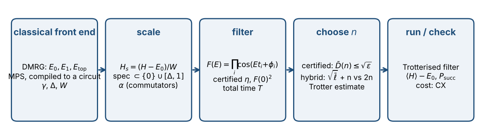
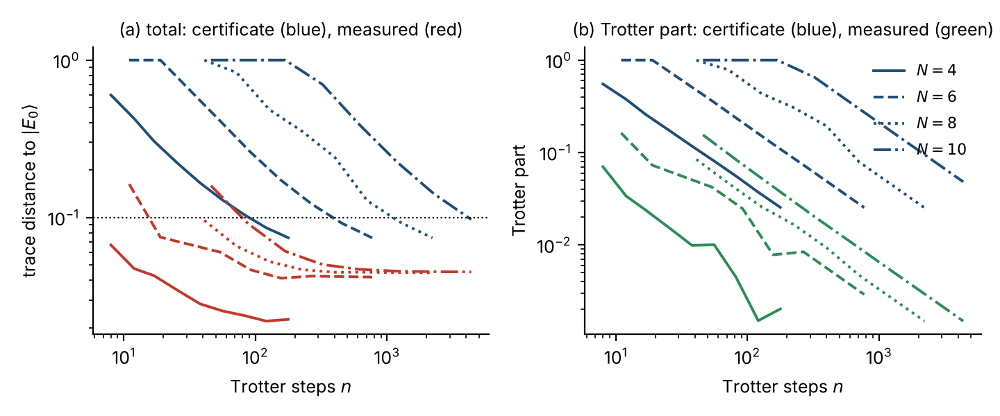
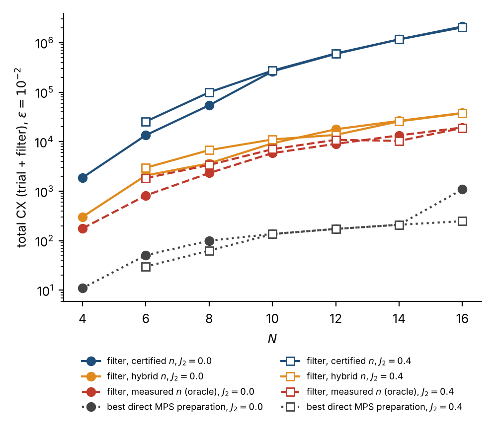

## Abstract

Density-matrix renormalisation group (DMRG) calculations give a matrix-product state and the low-lying energies of a spin chain classically, but a compact trial circuit built from them keeps some excited-state weight. The projection filter of Stetcu, Baroni and Carlson removes it on a quantum computer using one ancilla, controlled time evolution and post-selection. We give a complete workflow around this filter, from the DMRG front end to a verified state, and evaluate it on the open $J_1$–$J_2$ spin-½ chain for $N=4$–$16$ with real DMRG trial states compiled to circuits. The workflow contains a certificate: an a-priori bound on the trace distance $D$ to the exact ground state, $D\le\sqrt{\bar\ell}+\epsilon_T/\sqrt{p_g}$, a leakage term plus a Trotter term joined by the triangle inequality. We find that (i) DMRG supplies the inputs to $10^{-8}$ relative accuracy; (ii) the certificate is never violated (97 simulated points) and is within 2.2–5.1$\times$ of the measured distance, because its leakage term is nearly tight, while its Trotter term is 9–77$\times$ too large; (iii) a non-oracle *hybrid* rule (certified leakage plus a measured $n$-versus-$2n$ Trotter estimate) met every target (25 of 25 cases) with 6–66$\times$ fewer Trotter steps than the certificate; (iv) the certificate fails predictably if the classical inputs are optimistic (a gap over-estimated by $25\%$ already breaks it); and (v) in gates, the hybrid filter costs $3\times10^{2}$–$4\times10^{4}$ CX including the trial circuit, growing as roughly $N^{2.5}$–$N^{3.1}$, which is 28–151$\times$ the cost of preparing the state directly from the MPS at the same fidelity. The workflow is therefore a certified, reproducible way to use the filter, and a calibrated account of its cost, but not a resource advantage on these chains.

## 1. Introduction

A standard hybrid route to a ground state is to run DMRG, compile the resulting matrix-product state (MPS) into a shallow circuit, and repair the circuit's residual error with a quantum projection step. The Stetcu–Baroni–Carlson (SBC) projection [1], related to the rodeo algorithm [2], multiplies the trial state's energy components by a filter $F(E)=\prod_i\cos(Et_i+\phi_i)$ realised with pulses of controlled time evolution on a single ancilla. It sits among a family of ground-state projectors that use polynomial or Fourier filters of the Hamiltonian: phase-estimation-based preparation [3], quantum-eigenvalue-transformation filters [4,5] and, more generally, quantum singular value transformation. The SBC filter trades the optimal $\log(1/\varepsilon)$ scaling of those methods for a measurement-based, single-ancilla circuit whose filter can be designed and certified classically.

Someone deciding whether to use it needs to know **what the full workflow is, how much of its guarantee is rigorous and how much is assumed, and what it costs in gates**. This paper answers those questions for one concrete, fully reproducible workflow:

1. Section 2 specifies the workflow stage by stage, with the classical inputs it consumes and the certificate it produces.
2. Section 3 describes the experiments. Section 4 reports accuracy: the quality of the DMRG inputs, how tight the certificate is, how the step count should be chosen, how the trial state matters, what happens when inputs are wrong, and how sensitive the result is to design choices.
3. Section 5 reports cost in CX gates, including the trial circuit, how it scales, and how it compares with preparing the state directly from the MPS.
4. Section 6 states what the workflow does and does not establish.

We do not claim a resource advantage; Section 5 shows there is none at these sizes.

## 2. The workflow

{width=100%}

**Stage 1 — classical front end (DMRG).** From a Hamiltonian $H=\sum_gH_g$ (here the bonds of the chain) run DMRG for the ground-state energy $E_0$ and a high-bond-dimension reference MPS, DMRG on $-H$ for the top energy $E_{\mathrm{top}}$, and DMRG on $H+\lambda|\psi_0\rangle\langle\psi_0|$ with $\lambda=1.1(E_{\mathrm{top}}-E_0)$ for the first excitation $E_1$ (penalty method). Set $W=E_{\mathrm{top}}-E_0$, $H_s=(H-E_0)/W$, so that $\operatorname{spec}H_s\subset\{0\}\cup[\Delta,1]$ with $\Delta=(E_1-E_0)/W$.

**Stage 2 — trial state.** Run DMRG at a small maximum bond dimension $\chi$ and compile the MPS to a circuit (here exactly, by sequential isometries with `mps-to-circuit`; an approximate brickwork compilation is also tested). Estimate the ground-state weight $\gamma=|\langle E_0|\psi\rangle|^2$ as the overlap with the reference MPS. If $1-\gamma\le\varepsilon$ for the target $\varepsilon$, stop: the trial state already suffices.

**Stage 3 — filter.** One pulse $(t,\phi)$ applies $\mathsf H_{\mathrm{a}}\,e^{-itH_s\otimes Z_{\mathrm{a}}}\,\mathrm{Rz}_{\mathrm{a}}(2\phi)\,\mathsf H_{\mathrm{a}}$; its ancilla-$|0\rangle$ block is $\cos(H_st+\phi)$. Keeping outcome $0$ after $m$ pulses applies $F(E)=\prod_{i=1}^m\cos(Et_i+\phi_i)$, with total time $T=\sum_it_i$ and $F(0)=\prod_i\cos\phi_i$. Two numbers characterise the filter: $\eta=\sup_{E\in[\Delta,1]}|F(E)|/|F(0)|$ (suppression of excited states relative to the ground state) and $p_g=\gamma F(0)^2$ (a lower bound on the success probability). We design $(t_i,\phi_i)$ with `floor.py`, which maximises $F(0)^2$ subject to a *certified* bound on $\eta$ (interval bisection using $|F'|\le\sum|t_i|$ and $|F''|\le(\sum|t_i|)^2$), for a leakage budget $\varepsilon_\ell=\varepsilon/4$.

**Stage 4 — Trotterisation and the choice of $n$.** Each controlled evolution is $k_i$ first-order Lie–Trotter steps over the bonds, $n=\sum_ik_i$, $t_i=k_i\,dt$. The Trotter error is governed by the commutator constant $\alpha=\sum_g\big\|[H_g,\sum_{g'>g}H_{g'}]\big\|$ (the larger of the two product orders; the ancilla does not change it). Three rules choose $n$:

* **Certified.** The smallest $n$ with $\bar D(n)\le\sqrt\varepsilon$, where the *certificate* is
$$\boxed{\;D\le\bar D:=\sqrt{\bar\ell}+\frac{\alpha T^2}{2n\sqrt{\gamma F(0)^2}},\qquad\bar\ell=\frac{(1-\gamma)\eta^2}{\gamma+(1-\gamma)\eta^2}\;}$$
$D$ is the trace distance between the implemented and the exact ground state. The first term is **leakage** (what an exact filter would leave) and depends only on $\gamma$ and $\eta$; the second is the **Trotter** term. Equivalently, infidelity $\le\bar D^2$ and energy error $\langle H\rangle-E_0\le W\bar D^2$. The proof (Appendix A) is the triangle inequality for the trace distance plus a leakage lemma and a first-order Trotter lemma.
* **Hybrid.** Keep the rigorous leakage term but replace the worst-case Trotter term by a measured one. For each candidate $n$ on a geometric grid, run the same filter at $n$ and $2n$ steps; because the first-order error scales as $1/n$, the Trotter distance is $\approx2D(\tilde\varphi_n,\tilde\varphi_{2n})$. Accept the smallest $n$ such that $\sqrt{\bar\ell}+2D(\tilde\varphi_n,\tilde\varphi_{2n})\le\sqrt\varepsilon$ at that grid point and the next. This uses no ground state and is *not* a theorem (it assumes the $1/n$ regime), but it is what a practitioner can actually evaluate.
* **Measured (oracle).** The smallest $n$ whose measured $D$ meets the target. It needs the exact ground state, so it is a reference, not a rule.

**Stage 5 — run and check.** Execute the filter; check the post-selection rate, which is at least $p_g$, and, where the energy is measurable, $\langle H\rangle-E_0\le W\bar D^2$. If the device is noisy and prepares a mixed state $\tilde\rho$, the triangle inequality adds a noise term: $D(\tilde\rho,g)\le D(\tilde\rho,\tilde\varphi)+\bar D$.

**What is rigorous and what is assumed.**

| Quantity | Source | Status |
|---|---|---|
| $E_0$ | DMRG | variational upper bound; accurate to $\sim10^{-9}$ here |
| $E_{\mathrm{top}}$, $W$ | DMRG (or $W=\tfrac14\sum_gJ_g-E_0$ from the bond norms, valid for $J_g>0$) | the bond bound is rigorous up to the error in $E_0$; DMRG is accurate but uncertified |
| $E_1$, $\Delta$ | DMRG penalty method | an *upper* bound on $E_1$: the wrong side for a gap lower bound |
| $\gamma$ | overlap with a high-$\chi$ reference MPS | an overlap with an approximation of $|E_0\rangle$ |
| $\eta$, $F(0)$ | interval certificate | rigorous given $\Delta$ |
| $\alpha$ | exact operator norms of commutators | rigorous |
| leakage and Trotter terms | Lemmas 1 and 2 | rigorous *given* the inputs above |

The certificate is therefore as trustworthy as $\Delta$ and $\gamma$; Section 4.5 quantifies what happens when they are wrong.

## 3. Experiments

* **System.** Open spin-½ $J_1$–$J_2$ chain, $J_1=1$, $J_2\in\{0,0.4\}$, $N\in\{4,6,\dots,16\}$. Bonds are ordered: nearest-neighbour bonds with even then odd left site, then next-nearest-neighbour bonds likewise.
* **Front end.** Two-site DMRG (`quimb`) with the repository's `get_energies.py`; reference MPS up to bond dimension 64. The workflow sees only DMRG quantities. Exact diagonalisation is used afterwards to validate (true ground state, gap, overlap) and to measure distances.
* **Trial state.** DMRG at maximum bond dimension $\chi=2$ (main experiments), compiled exactly. $\chi\in\{1,2,4,8\}$ and $L$-layer approximate circuits are compared at $N=8$.
* **Targets.** $\varepsilon=10^{-1},10^{-2}$ ($N\le16$) and $10^{-3}$ ($N\le8$), i.e. $D\le0.32,0.1,0.032$.
* **Simulation.** Exact statevector simulation of the Trotterised filter, the ideal filter, and the ground state. A run is simulated only if $n\times\text{bonds}\times2\times2^N\le1.5\times10^{10}$; the $N=16$, $\varepsilon=10^{-2}$ certified circuits are not simulated, and their step counts and CX are reported from the certificate.
* **Cost.** One Trotter step of one pulse (for each bond, the $XX,YY,ZZ$ rotations tensored with $Z$ on the ancilla) is transpiled once with qiskit (level 3) to $\{\mathrm{CX},\mathrm{Rz},\mathrm{H},\mathrm{S}\}$; total CX is trial CX plus $n\times$ CX per step. All-to-all connectivity unless stated. The trial circuit is the exact `mps-to-circuit` compilation, transpiled the same way.
* **Direct-preparation baseline.** Preparing the state directly from the MPS: `mps-to-circuit` sequential (exact) circuits for the reference MPS truncated to $\chi\in\{1,2,4,8,16\}$, $L$-layer approximate circuits ($L\le8$), and generic state preparation of the exact ground state ($N\le12$). Each is measured against the exact ground state; the baseline for a target $\varepsilon$ is the cheapest with infidelity $\le\varepsilon$.

## 4. Accuracy

### 4.1 The classical front end supplies the inputs

| $N$ | $J_2$ | $\chi_{\mathrm{ref}}$ | $|E_0^{\mathrm{DMRG}}-E_0|$ | $|E_1^{\mathrm{DMRG}}-E_1|$ | $|\Delta^{\mathrm{DMRG}}-\Delta|/\Delta$ | $\gamma$ (DMRG-ref.) | $\gamma$ (exact) | trial CX | $\alpha$ |
|---|---|---|---|---|---|---|---|---|---|
| 4 | 0.0 | 4 | 2.0e-15 | 6.7e-16 | 4.0e-15 | 0.9541 | 0.9541 | 9 | 0.155 |
| 6 | 0.0 | 8 | 2.2e-15 | 1.3e-15 | 1.7e-15 | 0.8823 | 0.8823 | 15 | 0.124 |
| 8 | 0.0 | 16 | 3.1e-15 | 4.4e-16 | 6.7e-15 | 0.7748 | 0.7748 | 21 | 0.099 |
| 10 | 0.0 | 20 | 4.8e-10 | 2.1e-10 | 8.1e-10 | 0.6713 | 0.6713 | 27 | 0.082 |
| 12 | 0.0 | 23 | 1.2e-9 | 9.1e-10 | 9.4e-10 | 0.5911 | 0.5911 | 33 | 0.070 |
| 14 | 0.0 | 31 | 1.8e-9 | 1.8e-9 | 1.3e-10 | 0.5274 | 0.5274 | 39 | 0.060 |
| 16 | 0.0 | 36 | 2.2e-9 | 2.7e-9 | 2.5e-9 | 0.4750 | 0.4750 | 45 | 0.053 |
| 4 | 0.4 | 4 | 2.2e-15 | 4.4e-16 | 4.0e-15 | 0.9957 | 0.9957 | 9 | 0.201 |
| 6 | 0.4 | 8 | 4.4e-15 | 2.0e-15 | 5.0e-15 | 0.9873 | 0.9873 | 15 | 0.184 |
| 8 | 0.4 | 16 | 5.8e-15 | 6.8e-11 | 1.7e-10 | 0.9755 | 0.9755 | 21 | 0.153 |
| 10 | 0.4 | 18 | 1.7e-10 | 9.9e-10 | 2.4e-9 | 0.9613 | 0.9613 | 27 | 0.129 |
| 12 | 0.4 | 28 | 1.0e-9 | 7.3e-10 | 9.5e-10 | 0.9455 | 0.9455 | 33 | 0.111 |
| 14 | 0.4 | 31 | 1.0e-9 | 1.7e-9 | 2.5e-9 | 0.9286 | 0.9286 | 39 | 0.097 |
| 16 | 0.4 | 32 | 6.2e-10 | 3.0e-9 | 1.0e-8 | 0.9110 | 0.9110 | 45 | 0.086 |

*Table 1.* DMRG-derived inputs against exact diagonalisation. $\chi_{\mathrm{ref}}$ is the bond dimension the reference MPS used.

DMRG reproduces $E_0$, $E_1$ and the gap to better than 3e-9 (absolute) and 1e-8 (relative), and the estimated $\gamma$ differs from the exact overlap by at most 6e-8. At these sizes the certificate computed from DMRG inputs is therefore indistinguishable from the one computed from exact inputs. This is an empirical statement about well-behaved chains, not a guarantee: DMRG does not certify these numbers (Section 2) and the penalty $E_1$ is variationally on the unsafe side. Section 4.5 shows what an error of that sign does.

### 4.2 The certificate is accurate, mostly because leakage is tight

| $N$ | $J_2$ | $\gamma$ | $\Delta$ | $n_{\mathrm{bound}}$ | $n_{\mathrm{hyb}}$ | $n_{\mathrm{meas}}$ | bound $\bar D$ | $D$ at $n_{\mathrm{bound}}$ | leakage: bound / meas. | Trotter: bound / meas. |
|---|---|---|---|---|---|---|---|---|---|---|
| 4 | 0.0 | 0.954 | 0.278 | 89 | 14 | 8 | 0.099 | 0.024 | 2.2$\times$ | 12$\times$ |
| 6 | 0.0 | 0.882 | 0.131 | 386 | 59 | 23 | 0.100 | 0.042 | 1.2$\times$ | 9$\times$ |
| 8 | 0.0 | 0.775 | 0.077 | 1,108 | 74 | 47 | 0.100 | 0.045 | 1.1$\times$ | 17$\times$ |
| 10 | 0.0 | 0.671 | 0.050 | 4,182 | 147 | 93 | 0.099 | 0.045 | 1.1$\times$ | 32$\times$ |
| 12 | 0.0 | 0.591 | 0.036 | 7,712 | 231 | 117 | 0.099 | 0.046 | 1.1$\times$ | 41$\times$ |
| 14 | 0.0 | 0.527 | 0.027 | 12,807 | 289 | 147 | 0.100 | 0.045 | 1.1$\times$ | 52$\times$ |
| 16 | 0.0 | 0.475 | 0.021 | 20,198 | 362 | 184 | 0.100 | not simulated | – | – |
| 4 | 0.4 | 0.996 | 0.274 | – | – | – | – | 0.066$^\dagger$ | – | – |
| 6 | 0.4 | 0.987 | 0.128 | 405 | 47 | 29 | 0.100 | 0.023 | 2.4$\times$ | 10$\times$ |
| 8 | 0.4 | 0.976 | 0.075 | 1,091 | 74 | 37 | 0.100 | 0.020 | 2.7$\times$ | 20$\times$ |
| 10 | 0.4 | 0.961 | 0.050 | 2,292 | 93 | 59 | 0.100 | 0.021 | 2.4$\times$ | 30$\times$ |
| 12 | 0.4 | 0.945 | 0.036 | 4,121 | 93 | 74 | 0.100 | 0.026 | 1.9$\times$ | 39$\times$ |
| 14 | 0.4 | 0.929 | 0.027 | 6,656 | 147 | 59 | 0.100 | 0.022 | 2.2$\times$ | 77$\times$ |
| 16 | 0.4 | 0.911 | 0.021 | 10,026 | 184 | 93 | 0.100 | not simulated | – | – |

*Table 2.* $\varepsilon=10^{-2}$, $\chi=2$. $^\dagger$$1-\gamma\le\varepsilon$: no filter needed, and the entry is the trial state's own distance. $D$ is at $n_{\mathrm{bound}}$. The last two columns compare the certificate with the measurement, term by term.

* **Never violated.** Across 97 simulated points (every case at $n_{\mathrm{bound}}$ plus the $n$-sweeps) the total certificate, its leakage term, its Trotter term, the triangle inequality, the energy bound and $P_{\mathrm{succ}}\ge\gamma F(0)^2$ each held 97 out of 97 times. This checks the derivation and the code; the proofs are in Appendix A.
* **Close in total.** At $n_{\mathrm{bound}}$ the certificate exceeds the measured $D$ by 2.2–5.1$\times$ (median 3.9$\times$).
* **Leakage is nearly tight; Trotter is not.** The leakage term is within 1.1–2.7$\times$; the Trotter term is 9–77$\times$ too large and the discrepancy grows with $N$ (from $9\times$ at $N=6$ to $52$–$77\times$ at $N=14$), because $\alpha$ is a worst case over all states. The measured $D$ at $n_{\mathrm{bound}}$ is dominated by leakage (0.018–0.046, against a Trotter part of at most 0.006).
* **Scaling in $n$.** The Trotter certificate and the measured Trotter distance both fall as $1/n$ (fitted log–log slopes -1.01 to -0.99 and -1.17 to -0.93), so the certificate has the right scaling in $n$ and is off by a roughly constant factor (Figure 2). The measured total saturates at the leakage floor.
* **Other observables.** The energy bound $W\bar D^2$ holds but is 21–293$\times$ above the measured energy error. The success rate matches the lower bound $\gamma F(0)^2$ to 0.35% or better, so $1/(\gamma F(0)^2)$ is an accurate estimate of the repetition overhead.

{width=100%}

### 4.3 Choosing $n$: certified, hybrid, measured

| $N$ | $J_2$ | $\varepsilon$ | $n_{\mathrm{bound}}$ | $n_{\mathrm{hyb}}$ | $n_{\mathrm{meas}}$ | $D$ at $n_{\mathrm{hyb}}$ | $\sqrt\varepsilon$ | steps saved vs. certified |
|---|---|---|---|---|---|---|---|---|
| 4 | 0.0 | 0.01 | 89 | 14 | 8 | 0.056 | 0.100 | 6$\times$ |
| 4 | 0.0 | 0.001 | 380 | 47 | 11 | 0.007 | 0.032 | 8$\times$ |
| 6 | 0.0 | 0.01 | 386 | 59 | 23 | 0.058 | 0.100 | 7$\times$ |
| 6 | 0.0 | 0.001 | 2,651 | 184 | 117 | 0.021 | 0.032 | 14$\times$ |
| 8 | 0.0 | 0.01 | 1,108 | 74 | 47 | 0.065 | 0.100 | 15$\times$ |
| 8 | 0.0 | 0.001 | 7,577 | 567 | 567 | 0.018 | 0.032 | 13$\times$ |
| 10 | 0.0 | 0.01 | 4,182 | 147 | 93 | 0.065 | 0.100 | 28$\times$ |
| 12 | 0.0 | 0.01 | 7,712 | 231 | 117 | 0.063 | 0.100 | 33$\times$ |
| 14 | 0.0 | 0.01 | 12,807 | 289 | 147 | 0.064 | 0.100 | 44$\times$ |
| 16 | 0.0 | 0.01 | 20,198 | 362 | 184 | 0.063 | 0.100 | 56$\times$ |
| 4 | 0.4 | 0.001 | 363 | 37 | 18 | 0.012 | 0.032 | 10$\times$ |
| 6 | 0.4 | 0.01 | 405 | 47 | 29 | 0.059 | 0.100 | 9$\times$ |
| 6 | 0.4 | 0.001 | 1,790 | 74 | 23 | 0.009 | 0.032 | 24$\times$ |
| 8 | 0.4 | 0.01 | 1,091 | 74 | 37 | 0.050 | 0.100 | 15$\times$ |
| 8 | 0.4 | 0.001 | 4,881 | 74 | 29 | 0.012 | 0.032 | 66$\times$ |
| 10 | 0.4 | 0.01 | 2,292 | 93 | 59 | 0.056 | 0.100 | 25$\times$ |
| 12 | 0.4 | 0.01 | 4,121 | 93 | 74 | 0.037 | 0.100 | 44$\times$ |
| 14 | 0.4 | 0.01 | 6,656 | 147 | 59 | 0.032 | 0.100 | 45$\times$ |
| 16 | 0.4 | 0.01 | 10,026 | 184 | 93 | 0.037 | 0.100 | 54$\times$ |

*Table 3.* The hybrid rule against the certificate and the oracle. $D$ is measured at $n_{\mathrm{hyb}}$ against the exact ground state, which the rule itself never uses.

* The hybrid rule met the target in 25 of 25 cases, with a margin $\sqrt\varepsilon/D$ of 1.5–4.5$\times$.
* It uses 6–66$\times$ (median 18$\times$) fewer steps than the certificate and only 1.0–4.3$\times$ (median 2.0$\times$) more than the oracle. The gap to the oracle is mostly the coarse geometric grid and the requirement of confirmation at the next grid point.
* The n-versus-$2n$ estimate of the Trotter distance matched the measured one to within [0.998, 1.061] over 61 sweep points with $n\ge n_{\mathrm{meas}}$.
* The hybrid rule is not a theorem. It assumes the $1/n$ regime, which held in all runs here, and inherits the assumptions on $\gamma$ and $\Delta$ through its leakage term.

Step counts scale with the target roughly as the first-order theory predicts for the certificate ($n\propto\varepsilon^{-1/2}$ at fixed filter; observed ratios $n(10^{-3})/n(10^{-2})$ of $4$–$7$ include the tightening of the filter itself):

| $N$ | $J_2$ | $n_{\mathrm{bound}}$ ($\varepsilon=10^{-1}$) | ($10^{-2}$) | ($10^{-3}$) | ratio $10^{-3}/10^{-2}$ | $n_{\mathrm{hyb}}$ ($10^{-2}$ / $10^{-3}$) | $n_{\mathrm{meas}}$ ($10^{-2}$ / $10^{-3}$) |
|---|---|---|---|---|---|---|---|
| 4 | 0.0 | – | 89 | 380 | 4.3 | 14 / 47 | 8 / 11 |
| 6 | 0.0 | 87 | 386 | 2,651 | 6.9 | 59 / 184 | 23 / 117 |
| 8 | 0.0 | 247 | 1,108 | 7,577 | 6.8 | 74 / 567 | 47 / 567 |
| 6 | 0.4 | – | 405 | 1,790 | 4.4 | 47 / 74 | 29 / 23 |
| 8 | 0.4 | – | 1,091 | 4,881 | 4.5 | 74 / 74 | 37 / 29 |

*Table 4.* Certified step counts at three targets, and hybrid and measured counts at $10^{-2}$ and $10^{-3}$.

### 4.4 The choice of trial state

At $N=8$, $\varepsilon=10^{-2}$:

| $J_2$ | trial state | $\gamma$ | trial CX | $n_{\mathrm{bound}}$ | total CX, certified | total CX, hybrid |
|---|---|---|---|---|---|---|
| 0.0 | DMRG $\chi=1$ | 0.1336 | 0 | 8,519 | 417,431 | 5,733 |
| 0.0 | DMRG $\chi=2$ | 0.7748 | 21 | 1,108 | 54,313 | 3,647 |
| 0.0 | DMRG $\chi=4$ | 0.9986 | 99 | no filter needed | 99 | 99 |
| 0.0 | DMRG $\chi=8$ | 1.0000 | 329 | no filter needed | 329 | 329 |
| 0.0 | approx. circuit $L=1$ | 0.8371 | 21 | 992 | 48,629 | 3,647 |
| 0.0 | approx. circuit $L=2$ | 0.9195 | 42 | 864 | 42,378 | 2,933 |
| 0.0 | approx. circuit $L=3$ | 0.9600 | 63 | 749 | 36,764 | 2,366 |
| 0.4 | DMRG $\chi=1$ | 0.0361 | 0 | 33,636 | 3,060,876 | 21,021 |
| 0.4 | DMRG $\chi=2$ | 0.9755 | 21 | 1,091 | 99,302 | 6,755 |
| 0.4 | DMRG $\chi=4$ | 0.9999 | 100 | no filter needed | 100 | 100 |
| 0.4 | DMRG $\chi=8$ | 1.0000 | 329 | no filter needed | 329 | 329 |
| 0.4 | approx. circuit $L=1$ | 0.9770 | 21 | 1,075 | 97,846 | 6,755 |
| 0.4 | approx. circuit $L=2$ | 0.9867 | 42 | 992 | 90,314 | 8,505 |
| 0.4 | approx. circuit $L=3$ | 0.9927 | 63 | no filter needed | 63 | 63 |

*Table 5.* Trial state against total CX (trial plus filter). "Approx." is the $L$-layer `mps-to-circuit` brickwork compilation of the reference MPS.

A better trial state needs a much shorter filter: going from $\chi=1$ ($\gamma=0.13$ at $J_2=0$) to $\chi=2$ cuts the certified step count by $7.7\times$ ($31\times$ at $J_2=0.4$, where $\chi=1$ gives $\gamma=0.04$). For $\chi=4$ the DMRG state already meets the target and no filter is needed. A trial state produced by approximate compilation behaves like a DMRG state of the same $\gamma$: the filter only sees $\gamma$.

### 4.5 When the classical inputs are wrong

The certificate assumes $\Delta$ and $\gamma$ are known. We design and certify with deliberately wrong values and measure the true distance ($N=8$ and $12$, $J_2=0$, $\varepsilon=10^{-2}$):

| $N$ | input error | $n_{\mathrm{bound}}$ | claimed $\bar D$ | $\bar D$ with true inputs | measured $D$ | claim violated? | target $\sqrt\varepsilon$ missed? |
|---|---|---|---|---|---|---|---|
| 8 | gap -20\% | 1,734 | 0.100 | 0.100 | 0.022 | no | no |
| 8 | gap +0\% | 1,108 | 0.100 | 0.100 | 0.045 | no | no |
| 8 | gap +10\% | 910 | 0.100 | 0.130 | 0.069 | no | no |
| 8 | gap +25\% | 711 | 0.099 | 0.171 | 0.103 | yes | yes |
| 8 | gap +50\% | 488 | 0.100 | 0.229 | 0.151 | yes | yes |
| 8 | gap +100\% | 261 | 0.100 | 0.311 | 0.221 | yes | yes |
| 8 | $\gamma$ over-estimated (0.831 vs 0.775) | 1,009 | 0.099 | 0.111 | 0.053 | no | no |
| 8 | $\gamma$ over-estimated (0.887 vs 0.775) | 910 | 0.100 | 0.128 | 0.067 | no | no |
| 8 | $\gamma$ over-estimated (0.944 vs 0.775) | 800 | 0.100 | 0.164 | 0.100 | yes | yes |
| 12 | gap -20\% | 11,951 | 0.100 | 0.100 | 0.034 | no | no |
| 12 | gap +0\% | 7,712 | 0.099 | 0.099 | 0.046 | no | no |
| 12 | gap +10\% | 6,760 | 0.100 | 0.145 | 0.085 | no | no |
| 12 | gap +25\% | 4,881 | 0.100 | 0.224 | 0.155 | yes | yes |
| 12 | gap +50\% | 3,386 | 0.100 | 0.326 | 0.248 | yes | yes |
| 12 | gap +100\% | 1,902 | 0.100 | 0.456 | 0.368 | yes | yes |
| 12 | $\gamma$ over-estimated (0.693 vs 0.591) | 7,070 | 0.100 | 0.116 | 0.056 | no | no |
| 12 | $\gamma$ over-estimated (0.796 vs 0.591) | 3,570 | 0.100 | 0.139 | 0.075 | no | no |
| 12 | $\gamma$ over-estimated (0.898 vs 0.591) | 2,934 | 0.099 | 0.182 | 0.114 | yes | yes |

*Table 6.* "Claimed" is the certificate computed from the (wrong) inputs; "with true inputs" recomputes it with the true gap and overlap; "measured" is the actual distance.

* **Under-estimating the gap is safe** (the filter is designed for a wider window and costs more steps).
* **Over-estimating the gap is not.** At $+10\%$ the claimed bound still holds, but the guaranteed distance with true inputs is already $30$–$45\%$ above the claim; at $+25\%$ the claim is violated and the target missed at both sizes.
* **Over-estimating $\gamma$** behaves the same way, at a threshold that depends on how much of the excited weight is hidden.
* This is why the penalty-method $E_1$, which is an *upper* bound, must be treated with care: in this study it was accurate to $10^{-8}$, but the workflow should either certify $\Delta$ independently or design with a deliberately *reduced* gap: a $20\%$ reduction was safe and cost $1.55\times$ more steps at both sizes.

### 4.6 Sensitivity to design choices

At $N=8$, $J_2=0$, $\varepsilon=10^{-2}$, certified $n$ against the leakage share $\varepsilon_\ell/\varepsilon$ and the number of pulses $m$ (the solver searched $x=T\Delta/\pi\in\{0.6,1,1.5,2\}$):

| leakage share $\varepsilon_\ell/\varepsilon$ | $m=4$ | $m=6$ | $m=8$ |
|---|---|---|---|
| 0.05 | infeasible | 1,398 (6 pulses) | 1,398 (8 pulses) |
| 0.1 | infeasible | 1,511 (6 pulses) | 1,511 (8 pulses) |
| 0.25 | infeasible | 1,108 (6 pulses) | 1,124 (8 pulses) |
| 0.5 | infeasible | 1,651 (6 pulses) | 1,651 (8 pulses) |
| 0.75 | infeasible | 3,216 (6 pulses) | 3,216 (8 pulses) |

*Table 7.* Certified step count against design choices. Four pulses are infeasible for this trial state.

The certified $n$ varies by $3\times$ (1,108–3,216) over the shares tried, with a minimum near the $1/4$ used elsewhere; six and eight pulses are equivalent. The leakage share is the one design parameter worth tuning.

## 5. Cost

| $N$ | $J_2$ | trial CX | CX / step | filter CX: certified | filter CX: hybrid | filter CX: measured | total, certified | total, hybrid | best direct MPS prep. |
|---|---|---|---|---|---|---|---|---|---|
| 4 | 0.0 | 9 | 21 | 1,869 | 294 | 168 | 1,878 | 303 | 11 (generic) |
| 6 | 0.0 | 15 | 35 | 13,510 | 2,065 | 805 | 13,525 | 2,080 | 51 (generic) |
| 8 | 0.0 | 21 | 49 | 54,292 | 3,626 | 2,303 | 54,313 | 3,647 | 100 (sequential MPS, $\chi=4$) |
| 10 | 0.0 | 27 | 63 | 263,466 | 9,261 | 5,859 | 263,493 | 9,288 | 137 (sequential MPS, $\chi=4$) |
| 12 | 0.0 | 33 | 77 | 593,824 | 17,787 | 9,009 | 593,857 | 17,820 | 173 (sequential MPS, $\chi=4$) |
| 14 | 0.0 | 39 | 91 | 1,165,437 | 26,299 | 13,377 | 1,165,476 | 26,338 | 210 (sequential MPS, $\chi=4$) |
| 16 | 0.0 | 45 | 105 | 2,120,790 | 38,010 | 19,320 | 2,120,835 | 38,055 | 1,089 (sequential MPS, $\chi=8$) |
| 6 | 0.4 | 15 | 63 | 25,515 | 2,961 | 1,827 | 25,530 | 2,976 | 30 (approx. circuit, $L=2$) |
| 8 | 0.4 | 21 | 91 | 99,281 | 6,734 | 3,367 | 99,302 | 6,755 | 63 (approx. circuit, $L=3$) |
| 10 | 0.4 | 27 | 119 | 272,748 | 11,067 | 7,021 | 272,775 | 11,094 | 136 (sequential MPS, $\chi=4$) |
| 12 | 0.4 | 33 | 147 | 605,787 | 13,671 | 10,878 | 605,820 | 13,704 | 173 (sequential MPS, $\chi=4$) |
| 14 | 0.4 | 39 | 175 | 1,164,800 | 25,725 | 10,325 | 1,164,839 | 25,764 | 210 (sequential MPS, $\chi=4$) |
| 16 | 0.4 | 45 | 203 | 2,035,278 | 37,352 | 18,879 | 2,035,323 | 37,397 | 248 (sequential MPS, $\chi=4$) |

*Table 8.* $\varepsilon=10^{-2}$, $\chi=2$, all-to-all connectivity. Filter CX is $n\times$ CX per step; totals add the trial circuit. The last column is the cheapest direct preparation of the state at infidelity $\le\varepsilon$ (Section 3).

{width=65%}

* **Per step**, CX grows about linearly with the number of bonds ($N^{1.1}$ at $J_2=0$); $J_2=0.4$ costs about $1.9\times$ more because it has about twice as many bonds. A line with the ancilla at the end costs 1.4–3.0$\times$ more than all-to-all.
* **Scaling.** Over $N=6$–$16$, filter CX grows as $N^{5.3}$ (certified), $N^{3.1}$ (hybrid) and $N^{3.2}$ (measured) at $J_2=0$, and as $N^{4.5}$, $N^{2.5}$, $N^{2.3}$ at $J_2=0.4$. These are fits to at most six points. The steps themselves scale as $N^{4.1}$ (certified) and $N^{2.1}$ (measured), driven by $T^2\propto\Delta^{-2}$: the scaled gap falls from $0.28$ to $0.02$ over $N=4$–$16$.
* **Certified versus hybrid.** The certificate costs 6–56$\times$ (median 28$\times$) the hybrid circuit; the hybrid circuit is 1.3–2.6$\times$ the oracle.
* **Trial circuit.** For $\chi=2$ it costs $3(N-1)$ CX, negligible next to the filter.
* **Against direct preparation.** Directly compiling the MPS reaches the same infidelity with $11$–$250$ CX at every size except $N=16$, $J_2=0$ (a sequential $\chi=4$ circuit suffices at most sizes; there the required $\chi$ rises to $8$ and the cost to $1{,}089$ CX). The certified filter costs 171–8,207$\times$ more, the hybrid filter 28–151$\times$ more, and even the oracle filter 16–76$\times$ more. The ratio for the hybrid filter drops where the direct method must double its bond dimension (from about $125\times$ at $N=14$ to $35\times$ at $N=16$, $J_2=0$), because the filter's cost depends on $1/\Delta^2$ and $\alpha$ and not on entanglement; but at these sizes it never crosses.

The direct-preparation baselines for each size:

| $N$ | $J_2$ | MPS $\chi=2$ | MPS $\chi=4$ | MPS $\chi=8$ | approx. $L=1$ | approx. $L=3$ | generic |
|---|---|---|---|---|---|---|---|
| 4 | 0.0 | 9 (4.5e-2) | 25 (1.0e-16) | 25 (1.0e-16) | 9 (4.5e-2) | 27 (1.2e-3) | 11 |
| 4 | 0.4 | 9 (4.1e-3) | 25 (1.0e-16) | 25 (1.0e-16) | 9 (4.1e-3) | 27 (3.6e-4) | 11 |
| 6 | 0.0 | 15 (1.0e-1) | 62 (3.5e-4) | 139 (1.0e-16) | 15 (1.0e-1) | 45 (1.9e-2) | 51 |
| 6 | 0.4 | 15 (1.2e-2) | 62 (4.5e-5) | 139 (1.0e-16) | 15 (1.2e-2) | 45 (3.0e-3) | 57 |
| 8 | 0.0 | 21 (1.6e-1) | 100 (1.2e-3) | 329 (7.2e-7) | 21 (1.6e-1) | 63 (5.3e-2) | 247 |
| 8 | 0.4 | 21 (2.3e-2) | 100 (1.3e-4) | 329 (1.7e-7) | 21 (2.3e-2) | 63 (9.7e-3) | 247 |
| 10 | 0.0 | 27 (2.2e-1) | 137 (2.7e-3) | 519 (4.6e-6) | 27 (2.2e-1) | 81 (9.4e-2) | 1013 |
| 10 | 0.4 | 27 (3.6e-2) | 136 (2.6e-4) | 519 (1.6e-6) | 27 (3.6e-2) | 81 (1.7e-2) | 1013 |
| 12 | 0.0 | 33 (2.8e-1) | 173 (4.8e-3) | 709 (1.6e-5) | 33 (2.8e-1) | 99 (1.4e-1) | 4083 |
| 12 | 0.4 | 33 (5.1e-2) | 173 (4.5e-4) | 709 (6.9e-6) | 33 (5.1e-2) | 99 (2.7e-2) | 4083 |
| 14 | 0.0 | 39 (3.4e-1) | 210 (7.5e-3) | 899 (3.9e-5) | 39 (3.4e-1) | 117 (2.0e-1) | – |
| 14 | 0.4 | 39 (6.7e-2) | 210 (7.1e-4) | 899 (1.7e-5) | 39 (6.7e-2) | 117 (4.4e-2) | – |
| 16 | 0.0 | 45 (3.9e-1) | 247 (1.1e-2) | 1089 (7.9e-5) | 45 (3.9e-1) | 135 (2.5e-1) | – |
| 16 | 0.4 | 45 (8.3e-2) | 248 (1.0e-3) | 1089 (3.0e-5) | 45 (8.3e-2) | 135 (4.8e-2) | – |

*Table 9.* Direct preparation CX (infidelity to the exact ground state in parentheses), at $\chi=2,4,8$, $L=1,3$ approximate layers, and generic preparation ($N\le12$).

## 6. Discussion

**What the workflow gives.** A single procedure from DMRG output to a Trotter step count, with a certificate that held on every point tested, an explicit statement of which inputs it trusts, and a practical hybrid rule that is much cheaper than the certificate and met all targets. The certificate's leakage half is tight; its Trotter half is the price of a worst-case proof.

**What it costs.** At $\varepsilon=10^{-2}$ the hybrid circuit costs roughly $10^3$–$4\times10^4$ CX at $N=6$–$16$ against $30$–$1{,}100$ for direct MPS preparation. The filter is not competitive on these chains.

**When it could matter.** The filter's cost is set by the gap and the commutator constant, not by the state's entanglement; direct preparation's cost steps up each time the bond dimension must double. The data show the ratio narrowing at one such step ($N=16$, $J_2=0$) but not crossing. A genuine crossover would need systems where the required MPS bond dimension grows quickly with size (critical systems at larger $N$, or two dimensions) and where the filter can be run without paying for dense simulation. Neither is tested here.

**Limitations.**

* *Inputs.* The certificate needs $\gamma$ and $\Delta$. Here DMRG supplies them to $10^{-8}$ and exact diagonalisation validates them ($N\le16$). At larger $N$ there is no validation, and Section 4.5 shows the certificate breaks if the gap is optimistic. Certifying $\Delta$ at large $N$ is the main open point.
* *Models.* Two couplings of one chain.
* *Trotter order.* First order only; higher-order formulas would shrink the Trotter term but need a different constant.
* *Noise.* Not simulated; the triangle inequality gives an additive noise term.
* *Cost model.* CX only, all-to-all (a line costs about $2$–$3\times$ more), no T-count, no synthesis error; the CX per step is for a Heisenberg bond decomposition into three Pauli rotations and is not the cheapest possible.
* *Simulation.* Dense statevectors, so the large-$N$ reach of DMRG is not exercised, and the largest certified circuits are not simulated.
* *Hybrid rule.* An empirical rule that assumed the $1/n$ regime and had 25 test cases.

**Reproducibility.** All code is in `simple_paper/`: `dmrg_inputs.py` (DMRG front end and trial circuits), `workflow.py` (Hamiltonian, pulses, certificate), `run_experiments.py` (main grid), `run_extras.py` (trial states, wrong inputs, design choices, direct-preparation baseline), `resources.py` (CX counts), `pinsker_check.py`, `make_report.py`, `build_paper.py`; filter design is `j1j2_filter/floor.py`. They run in a Python 3.12 environment with `numpy`, `scipy`, `quimb`, `qiskit` and `mps-to-circuit`; set `OMP_NUM_THREADS=1` when running processes in parallel. The full set (all tables here) runs in one to two hours on four cores. Seeds are fixed, including the Lanczos start vector used for the exact ground state at $N\ge12$ (a $\chi=2$ cut passes through degenerate Schmidt values, so $\gamma$ is otherwise only reproducible to the third digit).

## References

1. I. Stetcu, A. Baroni, J. Carlson, "Projection algorithm for state preparation on quantum computers," *Phys. Rev. C* **105**, 064308 (2022).
2. K. Choi, D. Lee, J. Bonitati, Z. Qian, J. Watkins, "Rodeo algorithm for quantum computing," *Phys. Rev. Lett.* **127**, 040505 (2021).
3. D. Poulin, P. Wocjan, "Preparing ground states of quantum many-body systems on a quantum computer," *Phys. Rev. Lett.* **102**, 130503 (2009).
4. L. Lin, Y. Tong, "Near-optimal ground state preparation," *Quantum* **4**, 372 (2020).
5. Y. Dong, L. Lin, Y. Tong, "Ground-state preparation and energy estimation on early fault-tolerant quantum computers via quantum eigenvalue transformation of unitary matrices," *PRX Quantum* **3**, 040305 (2022).
6. A. M. Childs, Y. Su, M. C. Tran, N. Wiebe, S. Zhu, "Theory of Trotter error with commutator scaling," *Phys. Rev. X* **11**, 011020 (2021).
7. C. Schön, E. Solano, F. Verstraete, J. I. Cirac, M. M. Wolf, "Sequential generation of entangled multiqubit states," *Phys. Rev. Lett.* **95**, 110503 (2005).
8. S.-J. Ran, "Encoding of matrix product states into quantum circuits of one- and two-qubit gates," *Phys. Rev. A* **101**, 032310 (2020).
9. S. R. White, "Density matrix formulation for quantum renormalization groups," *Phys. Rev. Lett.* **69**, 2863 (1992); U. Schollwöck, "The density-matrix renormalization group in the age of matrix product states," *Ann. Phys.* **326**, 96 (2011).
10. M. A. Nielsen, I. L. Chuang, *Quantum Computation and Quantum Information* (Cambridge University Press, 2000), Ch. 9.
11. T. M. Cover, J. A. Thomas, *Elements of Information Theory* (Wiley, 2006), Lemma 11.6.1.

## Appendix A. Proof of the certificate

Write $D(\rho,\sigma)=\tfrac12\|\rho-\sigma\|_1$. For pure states $D=\sqrt{1-|\langle a|b\rangle|^2}=\sin\theta_{ab}$, with $\theta_{ab}$ the angle between the rays. $D$ obeys the triangle inequality. For any state $\rho$ and pure $g$, $1-\langle g|\rho|g\rangle\le D(\rho,g)\le\sqrt{1-\langle g|\rho|g\rangle}$; for pure $\rho$ the right side is an equality, so infidelity is $D^2$. Let $\varphi=F(H_s)\psi/\|F(H_s)\psi\|$ be the ideal filtered state and $\tilde\varphi$ the implemented one. The certificate follows from $D(\tilde\varphi,g)\le D(\tilde\varphi,\varphi)+D(\varphi,g)$ and two lemmas.

**Lemma 1 (leakage).** $D(\varphi,g)^2=\ell\le\bar\ell$.
*Proof.* The ground state sits at $E=0$, so $|\langle g|\varphi\rangle|^2=\gamma F(0)^2/(\gamma F(0)^2+y)$ with $y=\sum_{k\ge1}|c_k|^2F(E_k)^2$. All $E_k$, $k\ge1$, lie in $[\Delta,1]$, so $F(E_k)^2\le\eta^2F(0)^2$ and $y\le(1-\gamma)\eta^2F(0)^2$. Since $\ell=y/(\gamma F(0)^2+y)$ is increasing in $y$, the bound follows. $\square$

**Lemma 2 (Trotter).** $D(\tilde\varphi,\varphi)\le\min\{1,\epsilon_T/\sqrt{p_g}\}$ with $\epsilon_T=\sum_i\alpha t_i^2/(2k_i)=\alpha T^2/(2n)$.
*Proof.* Let $A_i=\langle0_{\mathrm{a}}|\mathcal W_i|0_{\mathrm{a}}\rangle$ and $\tilde A_i$ the Trotterised block; $a=A_m\cdots A_1\psi$, $b=\tilde A_m\cdots\tilde A_1\psi$. The first-order product-formula bound (below) gives $\|\mathcal W_i-\widetilde{\mathcal W}_i\|\le\alpha t_i^2/(2k_i)$; the blocks are compressions, so $\|A_i-\tilde A_i\|$ is no larger, and all blocks have norm $\le1$. Telescoping, $a-b=\sum_i(A_m\cdots A_{i+1})(A_i-\tilde A_i)(\tilde A_{i-1}\cdots\tilde A_1\psi)$, so $\|a-b\|\le\epsilon_T$. The rays of $a,b$ are $\varphi,\tilde\varphi$, so $D=\sin\angle(a,b)=\mathrm{dist}(a,\mathrm{span}\,b)/\|a\|\le\|a-b\|/\|a\|$, and $\|a\|^2=P_{\mathrm{succ}}\ge p_g$. $\square$

**Corollaries.** Infidelity $=D^2\le\bar D^2$. Energy: with $\tilde c_k$ the components of $\tilde\varphi$, $\langle H\rangle-E_0=\sum_{k\ge1}|\tilde c_k|^2(E_k-E_0)\le W(1-|\tilde c_0|^2)=WD^2$. Step count: for $\bar\ell\le\varepsilon/4$, $\bar D\le\sqrt\varepsilon$ holds if $n\ge\alpha T^2/\sqrt{\gamma F(0)^2\varepsilon}$; with $T=x\pi/\Delta$ the certified cost scales as $\alpha/\Delta^2$.

**First-order Trotter bound.** For Hermitian $A,B$, $U(s)=e^{-is(A+B)}$, $V(s)=e^{-isA}e^{-isB}$: $\frac{d}{ds}[U(\delta-s)V(s)]=iU(\delta-s)(B-e^{-isA}Be^{isA})V(s)$, so $U(\delta)-V(\delta)=-i\int_0^\delta U(\delta-s)(B-e^{-isA}Be^{isA})V(s)\,ds$. Since $\|B-e^{-isA}Be^{isA}\|\le s\|[A,B]\|$ and $U,V$ are unitary, $\|U(\delta)-V(\delta)\|\le\tfrac{\delta^2}2\|[A,B]\|$. For many terms apply this with $A=H_1$, $B=\sum_{g>1}H_g$ and recurse, giving $\frac{\delta^2}{2}\alpha$ per step; with $k$ steps of size $t/k$ the error is $\alpha t^2/(2k)$ [6]. The reversed product order gives the reversed sum, hence the maximum over orders. For $H_s\otimes Z$: $[H_gZ,H_{g'}Z]=[H_g,H_{g'}]\otimes\mathbb 1$, so $\alpha$ is unchanged; the constant shift commutes with everything and is applied exactly.

## Appendix B. Where Pinsker's inequality applies

For the target $|g\rangle\langle g|$ the relative entropy $S(\rho\|\,|g\rangle\langle g|)$ is infinite unless $\rho=|g\rangle\langle g|$, so $D\le\sqrt{S/2}$ gives nothing here, which is why the certificate uses the triangle inequality and fidelity instead. Pinsker does apply to the energy-resolved distributions $p_k=|c_k|^2$ (trial) and $q_k=p_kF(E_k)^2/P_{\mathrm{succ}}$ (filtered): $\mathrm{KL}(q\|p)=\sum_kq_k\ln(F(E_k)^2/P_{\mathrm{succ}})\le\ln(1/P_{\mathrm{succ}})$, and $\mathrm{TV}(p,q)\ge q_0-p_0=1-\ell-\gamma$, so with $\mathrm{TV}\le\sqrt{\mathrm{KL}/2}$,
$$P_{\mathrm{succ}}\le\exp\!\big(-2(1-\ell-\gamma)^2\big).$$
This is a necessary condition on the post-selection cost, not an error bound. We checked it on the 5 $\varepsilon=10^{-2}$ cases with $N\le8$ that need a filter: every inequality held, but the cap (0.91–1.00) is far above the actual $P_{\mathrm{succ}}$ (0.29–0.93), so it is uninformative for these trial states.
