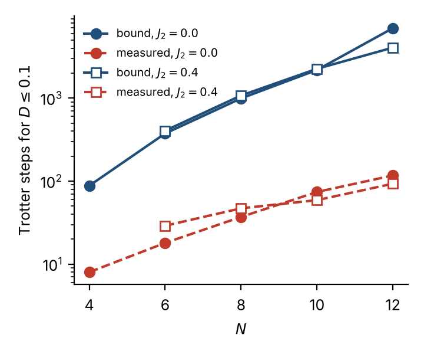

## Abstract

A common hybrid recipe for ground-state preparation is to obtain a matrix-product trial state and the low-lying energies classically (DMRG), then repair the trial state's residual excited-state weight on a quantum computer with the ancilla-based projection filter of Stetcu, Baroni and Carlson. We give a short, fully explicit a-priori error bound for this recipe. Writing $D$ for the trace distance between the prepared state and the exact ground state $|E_0\rangle$, the bound is a sum of two terms obtained from the triangle inequality: a *leakage* term, set by the trial-state ground-state weight $\gamma$ and a certified suppression factor $\eta$ of the filter on the excited spectrum, and a *Trotter* term, set by a first-order commutator constant $\alpha$, the total evolution time $T$ and the number of Trotter steps $n$. The bound needs only the trial state's overlap, the spectral gap, the filter and the Hamiltonian's term structure, and it converts to bounds on infidelity ($D^2$) and on the energy error ($W D^2$). We test it on the open spin-½ $J_1$–$J_2$ chain for $N=4$–$12$ with bond-dimension-2 trial states, by exact simulation of the Trotterised filter. All 88 simulated points satisfy every inequality. At the step count the bound prescribes for a target $D\le 0.1$, it overestimates the measured $D$ by $2.7$–$4.9\times$: the leakage term is nearly tight ($1.3$–$2.5\times$) while the Trotter term is conservative ($10$–$39\times$), so the bound asks for $11$–$60\times$ more Trotter steps than are empirically needed. Translated to two-qubit gates, the filter costs $2\times10^3$–$6\times10^5$ CX at the bound's step count ($2\times10^2$–$1.4\times10^4$ at the measured step count), growing roughly as $N^{4.6}$–$N^{5.2}$ (bound) and $N^{2.8}$–$N^{3.9}$ (measured) over $N=6$–$12$, against a $4\times$ increase per two qubits for exact generic state preparation. We also show where Pinsker's inequality does and does not enter.

## 1. Introduction

DMRG gives, classically and cheaply, an accurate matrix-product state (MPS) and estimates of the low-lying energies of a one-dimensional spin chain. An MPS of modest bond dimension can be compiled into a shallow circuit, but the resulting trial state $|\psi\rangle$ has ground-state weight $\gamma=|\langle E_0|\psi\rangle|^2<1$. The projection algorithm of Stetcu, Baroni and Carlson [1] (related to the rodeo algorithm [2]) repairs this with one ancilla, controlled time evolution under the Hamiltonian, and post-selection; the effect is to multiply the trial state's energy components by a filter $F(E)=\prod_i\cos(Et_i+\phi_i)$.

The question this note answers is the practical one: **given a trial state, the energies and a filter, how close is the prepared state to $|E_0\rangle$, and how many Trotter steps are enough?** We want an answer that (i) is a theorem, (ii) uses only quantities a practitioner has, (iii) fits in a few lines, and (iv) comes with empirical data showing how conservative it is.

**Contributions.**

1. A two-term bound $D\le\sqrt{\bar\ell}+\epsilon_T/\sqrt{p_g}$ on the trace distance to the ground state (Theorem 1), proved from three elementary facts: trace distance of pure states is $\sqrt{1-|\langle\cdot|\cdot\rangle|^2}$; it obeys the triangle inequality; and the leakage and Trotter errors can each be bounded separately. Corollaries give infidelity, energy error, and the number of Trotter steps.
2. An end-to-end workflow (Section 4) from trial state and energies to a certified step count.
3. An empirical study (Section 5): the bound is never violated, and we quantify which of its two terms is loose.
4. CX-count resource scaling of the certified and the measured step counts, on all-to-all and line connectivity (Section 5.8).
5. A short account of where Pinsker's inequality fits (Section 3.5), including why it cannot replace the triangle-inequality argument for a pure target.

**What is not claimed.** The bound is first-order-Trotter only and assumes the gap, $\gamma$ and the ground energy are known (here: from exact diagonalisation, $N\le12$). Hardware noise and gate synthesis are not modelled. Section 6 lists the consequences. Resource counts are CX only (no T counts or synthesis error), noiseless, for the filter alone (the trial-state circuit is not included). A companion cost study in this repository (`evaluation/`) compares the filter with direct MPS-circuit preparation and finds no resource advantage for 1D chains with $N\le12$; Section 5.8 uses a weaker baseline (exact generic state preparation) and does not revisit that conclusion.

## 2. Setting and notation

**Hamiltonian and energies.** $H=\sum_{g=1}^{\Gamma}H_g$ is a sum of $\Gamma$ terms; for the open $J_1$–$J_2$ chain each $H_g=J\,\mathbf S_i\!\cdot\!\mathbf S_j$ is one bond ($j=i+1$ or $i+2$). Let $E_0<E_1\le\dots\le E_{\mathrm{top}}$ be the spectrum, $W=E_{\mathrm{top}}-E_0$ (any $W\ge E_{\mathrm{top}}-E_0$ works), and

$$H_s=\frac{H-E_0}{W},\qquad \operatorname{spec}(H_s)\subset\{0\}\cup[\Delta,1],\quad \Delta=\frac{E_1-E_0}{W}.$$

The ground state $|g\rangle=|E_0\rangle$ is non-degenerate (even $N$, singlet).

**Trial state.** $|\psi\rangle=\sum_kc_k|E_k\rangle$, $\gamma=|c_0|^2$.

**Filter.** One pulse acts on the system and an ancilla in $|0\rangle$: $\mathcal W(t,\phi)=\mathsf H_{\mathrm{a}}\,e^{-itH_s\otimes Z_{\mathrm{a}}}\,\mathrm{Rz}_{\mathrm{a}}(2\phi)\,\mathsf H_{\mathrm{a}}$, and $\langle0_{\mathrm{a}}|\mathcal W|0_{\mathrm{a}}\rangle=\cos(H_st+\phi)$. Keeping ancilla outcome $0$ after each of $m$ pulses $(t_i,\phi_i)$ applies, up to normalisation,

$$F(E)=\prod_{i=1}^m\cos(Et_i+\phi_i),\qquad T=\sum_it_i,\qquad F(0)=\prod_i\cos\phi_i .$$

Define $\eta=\sup_{E\in[\Delta,1]}|F(E)|/|F(0)|$ (smaller is better) and $p_g=\gamma F(0)^2$. The success probability is $P_{\mathrm{succ}}=\sum_k|c_k|^2F(E_k)^2\ge p_g$.

**Two states.** The *ideal* filtered state is $|\varphi\rangle=F(H_s)|\psi\rangle/\|F(H_s)\psi\|$. The *implemented* state $|\tilde\varphi\rangle$ replaces each $e^{-it_iH_s\otimes Z}$ by $k_i$ first-order Lie–Trotter steps of size $dt=t_i/k_i$ over the terms $H_g$ in a fixed order, with $n=\sum_ik_i$ and $t_i=k_i\,dt$ (so $T=n\,dt$).

**Commutator constant.** $\alpha=\sum_{g}\big\|[H_g,\sum_{g'>g}H_{g'}]\big\|$ for $H_s$ with the terms in circuit order, taking the larger of the forward and reversed order (so the bound does not depend on the product convention). The ancilla does not change it, because $[H_gZ,H_{g'}Z]=[H_g,H_{g'}]\otimes\mathbb 1$.

{width=100%}

## 3. The bound

### 3.1 Trace distance, the triangle inequality, and fidelity

For states $\rho,\sigma$ let $D(\rho,\sigma)=\tfrac12\|\rho-\sigma\|_1=\tfrac12\operatorname{Tr}|\rho-\sigma|$. Three facts are used.

* **(D1) Pure states.** $D(|a\rangle\langle a|,|b\rangle\langle b|)=\sqrt{1-|\langle a|b\rangle|^2}=\sin\theta_{ab}$, where $\theta_{ab}$ is the angle between the rays.
* **(D2) Triangle inequality.** $D(\rho,\tau)\le D(\rho,\sigma)+D(\sigma,\tau)$, since the trace norm is a norm.
* **(D3) Fidelity (Fuchs–van de Graaf type).** For any state $\rho$ and pure $|g\rangle$, $\;1-\langle g|\rho|g\rangle\le D(\rho,|g\rangle\langle g|)\le\sqrt{1-\langle g|\rho|g\rangle}$. For pure $\rho$ the right-hand side is an equality, so infidelity $=D^2$.

The lower bound in (D3) holds because $D\ge\operatorname{Tr}[|g\rangle\langle g|(\sigma-\rho)]$ with $\sigma=|g\rangle\langle g|$.

### 3.2 Leakage: how well would an exact filter do?

**Lemma 1 (leakage).** If $F(0)\ne0$, the ideal filtered state satisfies
$$\ell:=1-|\langle g|\varphi\rangle|^2\;\le\;\bar\ell:=\frac{(1-\gamma)\,\eta^2}{\gamma+(1-\gamma)\,\eta^2},\qquad\text{so}\qquad D(\varphi,g)=\sqrt{\ell}\le\sqrt{\bar\ell}.$$

*Proof.* The ground state sits at $E=0$ in the scaled spectrum, so $|\langle g|\varphi\rangle|^2=\gamma F(0)^2/(\gamma F(0)^2+y)$ with $y=\sum_{k\ge1}|c_k|^2F(E_k)^2$. All $E_k$, $k\ge1$, lie in $[\Delta,1]$, so $F(E_k)^2\le\eta^2F(0)^2$ and $y\le(1-\gamma)\eta^2F(0)^2$. Since $\ell=y/(\gamma F(0)^2+y)$ is increasing in $y$, substituting the bound for $y$ gives the claim. The equality $D=\sqrt\ell$ is (D1). $\square$

$\eta$ is *certified* rather than sampled: $|F'|\le L:=\sum_i|t_i|$ and $|F''|\le L^2$, so on an interval of half-width $d$ about $E_c$, $|F(E)|\le|F(E_c)|+|F'(E_c)|d+\tfrac12L^2d^2$; interval bisection with this envelope gives a rigorous upper bound on $\sup_{[\Delta,1]}|F|$ (`floor.certify`).

### 3.3 Trotter error of the post-selected state

**Lemma 2 (Trotter).** Let $A_i=\langle0_{\mathrm{a}}|\mathcal W(t_i,\phi_i)|0_{\mathrm{a}}\rangle$ and $\tilde A_i$ the same block with $k_i$ Trotter steps, and set $a=A_m\cdots A_1\psi$, $b=\tilde A_m\cdots\tilde A_1\psi$ (un-normalised). Then
$$\|a-b\|\le\epsilon_T:=\sum_{i=1}^m\frac{\alpha\,t_i^2}{2k_i}=\frac{\alpha T^2}{2n}\quad(t_i=k_i\,dt),\qquad D(\tilde\varphi,\varphi)\le\min\Big\{1,\frac{\epsilon_T}{\sqrt{p_g}}\Big\}.$$

*Proof.* (i) The first-order product-formula bound (Appendix A, following Childs et al. [3]) gives $\|\mathcal W_i-\widetilde{\mathcal W}_i\|\le\alpha t_i^2/(2k_i)$. (ii) $A_i,\tilde A_i$ are compressions of $\mathcal W_i,\widetilde{\mathcal W}_i$ to the ancilla-$|0\rangle$ block, so $\|A_i-\tilde A_i\|\le\|\mathcal W_i-\widetilde{\mathcal W}_i\|$, and $\|A_i\|,\|\tilde A_i\|\le1$. (iii) Telescoping, $a-b=\sum_i(A_m\cdots A_{i+1})(A_i-\tilde A_i)(\tilde A_{i-1}\cdots\tilde A_1\psi)$, so $\|a-b\|\le\sum_i\epsilon_i$. (iv) The rays of $a$ and $b$ are $\varphi$ and $\tilde\varphi$. By (D1), $D=\sin\angle(a,b)=\operatorname{dist}(a,\operatorname{span}b)/\|a\|\le\|a-b\|/\|a\|$, and $\|a\|^2=P_{\mathrm{succ}}\ge p_g$. $\square$

### 3.4 The bound

**Theorem 1.** Under the assumptions of Section 2,
$$\boxed{\;D(\tilde\varphi,g)\;\le\;\bar D:=\min\Big\{1,\;\sqrt{\bar\ell}+\frac{\alpha T^2}{2n\sqrt{\gamma F(0)^2}}\Big\}\;}$$

*Proof.* Triangle inequality (D2): $D(\tilde\varphi,g)\le D(\tilde\varphi,\varphi)+D(\varphi,g)$. Bound the first term by Lemma 2 and the second by Lemma 1. $\square$

**Corollary 1 (infidelity).** $1-|\langle g|\tilde\varphi\rangle|^2=D^2\le\bar D^2$.

**Corollary 2 (energy).** $\langle\tilde\varphi|H|\tilde\varphi\rangle-E_0\le W\,D^2\le W\bar D^2$.
*Proof.* With $\tilde c_k$ the components of $\tilde\varphi$, $\sum_{k\ge1}|\tilde c_k|^2(E_k-E_0)\le W\sum_{k\ge1}|\tilde c_k|^2=W(1-|\tilde c_0|^2)=WD^2$. $\square$

**Corollary 3 (step count).** For a target $D\le\sqrt\varepsilon$ and a certified $\bar\ell<\varepsilon$, it suffices that
$$n\;\ge\;\frac{\alpha T^2}{2\sqrt{\gamma F(0)^2}\,\big(\sqrt\varepsilon-\sqrt{\bar\ell}\big)},\qquad\text{e.g. }\ n\ge\frac{\alpha T^2}{\sqrt{\gamma F(0)^2\,\varepsilon}}\ \text{ if }\bar\ell\le\varepsilon/4 .$$
Since $T=x\pi/\Delta$ with $x=O(1)$ chosen by the filter design, $n\propto\alpha/(\Delta^2\sqrt{\gamma F(0)^2\varepsilon})$.

The design problem is then: choose $(t_i,\phi_i)$ to maximise $F(0)^2$ (hence $p_g$ and $P_{\mathrm{succ}}$) subject to certified $\eta\le\eta_*$, where $\eta_*^2=\gamma\varepsilon_\ell/((1-\varepsilon_\ell)(1-\gamma))$ makes $\bar\ell=\varepsilon_\ell$. We use the solver `floor.py` for this.

### 3.5 Remarks: noise, tightness, and Pinsker

**Mixed states and noise.** If the device prepares a mixed state $\tilde\rho$ (e.g. with noise), (D2) still applies: $D(\tilde\rho,g)\le D(\tilde\rho,\tilde\varphi)+\bar D$. The infidelity bound then degrades from $D^2$ to $D$ via (D3).

**Sharpening.** With angles instead of sines, $D\le\sin\!\big(\arcsin\sqrt{\bar\ell}+\arcsin(\epsilon_T/\sqrt{p_g})\big)$ whenever the sum of angles is at most $\pi/2$. It is slightly tighter and no harder to compute; we keep the additive form because it is the one that reads off as "leakage plus Trotter".

**Pinsker.** For the *target* $|g\rangle\langle g|$, Pinsker's inequality $D\le\sqrt{S(\rho\|\sigma)/2}$ is vacuous in the useful direction: $S(\rho\|\,|g\rangle\langle g|)=+\infty$ unless $\rho=|g\rangle\langle g|$, because $\rho$ has support outside a pure state. This is why the argument above goes through fidelity and the triangle inequality rather than relative entropy. Pinsker does enter if one looks at the *energy-resolved distributions* $p_k=|c_k|^2$ (trial) and $q_k=p_kF(E_k)^2/P_{\mathrm{succ}}$ (ideally filtered), for which

$$\mathrm{KL}(q\|p)=\sum_kq_k\ln\frac{F(E_k)^2}{P_{\mathrm{succ}}}\le\ln\frac1{P_{\mathrm{succ}}}\quad(|F|\le1),\qquad \mathrm{TV}(p,q)\le\sqrt{\tfrac12\mathrm{KL}(q\|p)},$$

while $\mathrm{TV}(p,q)\ge q_0-p_0=1-\ell-\gamma$. Together,
$$P_{\mathrm{succ}}\;\le\;\exp\!\big(-2(1-\ell-\gamma)^2\big):$$
post-selection cannot be free if the filter is to move weight from $\gamma$ to $1-\ell$. This is a necessary condition on the cost, not an error bound, and (Section 5.8) it is weak for the cases studied. We include it to mark where relative-entropy tools apply and to be explicit that they do not drive the main result.

## 4. The workflow

1. **Inputs.** The Hamiltonian grouped as $\sum_gH_g$; $E_0,E_1,E_{\mathrm{top}}$; the trial state $|\psi\rangle$ (statevector or circuit).
2. **Scale.** $W=E_{\mathrm{top}}-E_0$ (or any certified upper bound), $H_s$, $\Delta$.
3. **Overlap.** $\gamma=|\langle E_0|\psi\rangle|^2$. If $1-\gamma\le\varepsilon$, the trial state already meets the target ($D=\sqrt{1-\gamma}\le\sqrt\varepsilon$) and no filter is needed.
4. **Filter.** Choose a leakage budget $\varepsilon_\ell$ (we use $\varepsilon/4$); solve for $(t_i,\phi_i)$ maximising $F(0)^2$ with certified $\eta\le\eta_*$; obtain $T$.
5. **Commutator constant.** Compute $\alpha$ for the chosen term order (both orders, take the max).
6. **Step count.** For each candidate $n$: snap the pulses to integer step counts $k_i$ with $t_i=k_i\,dt$, re-optimise the phases and re-certify $\eta$, evaluate $\bar D(n)$ of Theorem 1; take the smallest $n$ with $\bar D(n)\le\sqrt\varepsilon$.
7. **Run and check.** Simulate or run the Trotterised filter; compare the observables the bound speaks about: infidelity, $\langle H\rangle-E_0$, and the post-selection rate $P_{\mathrm{succ}}\ge\gamma F(0)^2$.

## 5. Empirical study

### 5.1 Set-up

* **System.** Open spin-½ $J_1$–$J_2$ chain, $J_1=1$, $J_2\in\{0,0.4\}$, $N\in\{4,6,8,10,12\}$. Terms $H_g$ are the bonds, in the order: nearest-neighbour bonds with even left site, with odd left site, then next-nearest-neighbour bonds likewise. Exact $E_0,E_1,E_{\mathrm{top}}$ and $|g\rangle$ come from dense ($N\le10$) or Lanczos ($N=12$) diagonalisation.
* **Trial state.** The exact ground state truncated by successive SVDs to MPS bond dimension $\chi=2$ (a stand-in for a bond-dimension-2 DMRG state; $\gamma=0.72$–$0.996$). Section 5.6 varies $\chi$ at $N=8$.
* **Filter.** `floor.py` designs: $m\in\{4,6\}$ pulses, $x=T\Delta/\pi\in\{0.6,1,1.5,2\}$, leakage budget $\varepsilon_\ell=\varepsilon/4$, $\eta$ certified by interval bisection, then snapped to $n$ steps with phases re-optimised and $\eta$ re-certified.
* **Targets.** $\varepsilon=10^{-2}$ ($D\le0.1$) and $\varepsilon=10^{-1}$ ($D\le0.316$).
* **Measurement.** Exact statevector simulation of the Trotterised filter (ancilla branches $\pm$ simulated separately, the constant shift included in the phases), and of the exact filter via sparse matrix exponentials. We record $D(\tilde\varphi,g)$, $D(\varphi,g)$ and $D(\tilde\varphi,\varphi)$, the energy error, and $P_{\mathrm{succ}}$.
* **Two step counts.** $n_{\mathrm{bound}}$ is the smallest $n$ with $\bar D(n)\le\sqrt\varepsilon$ (Section 4, step 6). $n_{\mathrm{emp}}$ is the smallest $n$ on a geometric grid with *measured* $D\le\sqrt\varepsilon$. It uses the exact ground state, so it is an oracle, not something a practitioner has.

### 5.2 The bound is never violated

Over all 88 simulated points (every case, at $n_{\mathrm{bound}}$ and along the sweeps in Section 5.4), each of the following held in every instance:

| inequality | holds |
|---|---|
| total: $D\le\bar D$ (Theorem 1) | 88 / 88 |
| leakage: $D(\varphi,g)\le\sqrt{\bar\ell}$ (Lemma 1) | 88 / 88 |
| Trotter: $D(\tilde\varphi,\varphi)\le\epsilon_T/\sqrt{p_g}$ (Lemma 2) | 88 / 88 |
| triangle inequality: $D(\tilde\varphi,g)\le D(\tilde\varphi,\varphi)+D(\varphi,g)$ | 88 / 88 |
| energy: $\langle H\rangle-E_0\le W\bar D^2$ (Corollary 2) | 88 / 88 |
| post-selection: $P_{\mathrm{succ}}\ge\gamma F(0)^2$ | 88 / 88 |

(The checks are a consistency test of the derivation and of the code, not a proof. The proofs are in Section 3 and Appendix A.)

### 5.3 Main results

{{main}}

*Table 1.* One row per case. $\Delta$ is the scaled gap; $\alpha$ the commutator constant; $T$ the total filter time (units of $W^{-1}$); $\eta$ the certified suppression at $n_{\mathrm{bound}}$. Rows with "(trial)" have $1-\gamma\le\varepsilon$: no filter is needed and the entry in the $D$ column is the trial state's own distance $\sqrt{1-\gamma}$.

At the prescribed $n_{\mathrm{bound}}$, the bound exceeds the measured distance by {{total_ratio_lo}}–{{total_ratio_hi}}$\times$ (median {{total_ratio_med}}$\times$). The step count it prescribes is {{n_ratio_lo}}–{{n_ratio_hi}}$\times$ (median {{n_ratio_med}}$\times$) the oracle $n_{\mathrm{emp}}$ (Figure 2).

{width=55%}

### 5.4 Which term is loose?

{{components}}

*Table 2.* $\varepsilon=10^{-2}$, at $n_{\mathrm{bound}}$. Bars denote the bound; unbarred the measured distance. Last two columns: measured success probability of the Trotterised filter and the guaranteed lower bound.

* **Leakage** is nearly tight: bound/measured $=${{leak_ratio_lo}}–{{leak_ratio_hi}}. The only slack is that every excited component is charged the worst-case filter value $\eta F(0)$.
* **Trotter** is conservative: {{trot_ratio_lo}}–{{trot_ratio_hi}}$\times$. The constant $\alpha$ is a worst case over all states. The companion analysis in `evaluation/` found that the ground state sees a first-order Trotter coefficient 28–41$\times$ smaller than $\alpha$ at $J_2=0$; we did not re-measure that here.
* **Total.** The measured $D$ at $n_{\mathrm{bound}}$ is dominated by leakage ($D_{\mathrm{leak}}\approx0.02$–$0.04$ vs. $D_{\mathrm{Trot}}\lesssim0.005$), which is why the bound is within a factor 3–5 although the Trotter term alone is loose by $10$–$39\times$.
* **Success probability.** $P_{\mathrm{succ}}$ agrees with $\gamma F(0)^2$ to {{psucc_dev_max}}% (relative), so $1/(\gamma F(0)^2)$ is an accurate estimate of the repetition cost.

{width=100%}

### 5.5 Dependence on $n$

Figure 3 shows the sweep. Both the Trotter bound and the measured Trotter distance fall as $1/n$ (fitted log–log slopes $-0.98$ to $-1.01$ for the bound and $-0.99$ to $-1.09$ for the measurement, over the sweep points where the bound is non-trivial, in all 9 sweeps), so the bound has the right *scaling* in $n$ and is off by a roughly constant factor. The measured total distance saturates at the leakage floor $D_{\mathrm{leak}}$, as it must: more Trotter steps cannot reduce leakage. The non-monotone dips at small $n$ are the pre-asymptotic regime ($n$ comparable to the number of pulses).

### 5.6 Observables and a non-oracle estimate

{{energy}}

*Table 3.* $\varepsilon=10^{-2}$ at $n_{\mathrm{bound}}$. Energy bound (Corollary 2) vs. measured energy error; and a Richardson-type Trotter estimate $\hat D_{\mathrm{Trot}}=2\,D(\tilde\varphi_n,\tilde\varphi_{2n})$, which compares the same filter at $n$ and $2n$ steps and does not use $|g\rangle$.

* **Energy.** Corollary 2 holds but is conservative by {{energy_ratio_lo}}–{{energy_ratio_hi}}$\times$, because the bound charges every unit of excited weight the full bandwidth $W$.
* **Richardson estimate.** Across the 60 sweep points with $n\ge n_{\mathrm{emp}}$ the ratio $\hat D_{\mathrm{Trot}}/D_{\mathrm{Trot}}$ lies in [{{rich_lo}}, {{rich_hi}}] (median {{rich_med}}). It is an *estimate*, not a bound: it assumes the error vector scales as $1/n$. It is the natural practical complement to Theorem 1, giving a rigorous leakage term plus an empirical Trotter term.

**Effect of the trial state.** At $N=8$, $J_2=0$, $\varepsilon=10^{-2}$:

{{chi}}

*Table 4.* A better trial state needs fewer Trotter steps (larger $\gamma$ means a larger $\eta_*$, so a shorter, cheaper filter), and for $\chi=4$ ($\gamma=0.9988$) no filter is needed at this target.

### 5.7 Resource scaling: CX counts

One Trotter step of one pulse is, for each bond, the three Pauli rotations $XX,YY,ZZ$ on the bond tensored with $Z$ on the ancilla, transpiled with qiskit (optimisation level 3) to $\{\mathrm{CX},\mathrm{Rz},\mathrm{H},\mathrm{S}\}$. Ancilla Hadamards and phase rotations add no CX, so the total is $n\times(\text{CX per step})$. The per-step count was identical for 1 and 3 consecutive steps on all-to-all connectivity (no cross-step cancellation); on a line with the ancilla at the end it grows with repetition, and we use the 3-step average there.

{{resources}}

*Table 5.* $\varepsilon=10^{-2}$, $\chi=2$. CX totals are $n\times$ per-step CX, for the step count prescribed by the bound and for the oracle measured step count. The last column is qiskit's exact preparation of a generic $N$-qubit state (no structure used).

{width=55%}

* **Per step.** CX per step grows as $N^{{{cxstep0}}}$ ($J_2=0$) and $N^{{{cxstep4}}}$ ($J_2=0.4$): linear in the number of bonds, with $J_2=0.4$ about twice as expensive (twice as many bonds, plus longer-range gates). A line with the ancilla at the end costs about $1.4$–$2.6\times$ more.
* **Steps.** The bound's $n$ grows as $N^{{{nb0}}}$ ($J_2=0$), the measured one as $N^{{{ne0}}}$: the bound's growth reflects $T^2\propto\Delta^{-2}$, with the scaled gap falling from $0.28$ to $0.036$ over $N=4$–$12$.
* **Total.** CX at the bound's $n$ grows as $N^{{{cxb0}}}$ ($J_2=0$; $N^{{{cxb4}}}$ at $J_2=0.4$) and at the measured $n$ as $N^{{{cxe0}}}$ ($N^{{{cxe4}}}$). The bound costs {{cxr_lo}}–{{cxr_hi}}$\times$ more than the measured count, as for the steps, since CX per step is the same.
* **Against exact generic preparation.** Generic preparation grows by a factor {{gen_growth}} per two qubits (exponential). The filter at the *measured* step count falls from {{eg4}}$\times$ the generic cost at $N=4$ to {{eg12}}$\times$ at $N=12$ ($J_2=0$), so a crossover could appear a little above $N=12$ *if* the power laws continued and if one had the oracle step count. At the *bound's* step count the filter stays {{bg_lo}}–{{bg_hi}}$\times$ more expensive than generic preparation throughout. These are fits over $N=6$–$12$ (five points at most) and not a prediction; exact generic preparation is also a weak baseline. Any structured preparation of an MPS (companion study) is cheaper still for these chains.

### 5.8 Pinsker numerics

For $\chi=2$, $\varepsilon=10^{-2}$ and $(N,J_2)\in\{(4,0),(6,0),(8,0),(6,0.4),(8,0.4)\}$, the energy-resolved quantities of Section 3.5 (computed for the continuous filter designs and the exact filter) satisfy $\mathrm{KL}(q\|p)\le\ln(1/P_{\mathrm{succ}})$ and $\mathrm{TV}(p,q)\le\sqrt{\mathrm{KL}/2}$ in every case, as they must. The implied cap on the success probability, $\exp(-2(1-\ell-\gamma)^2)$, is $0.95$–$1.00$, against actual $P_{\mathrm{succ}}$ between $0.36$ and $0.94$. It is true but too weak to be informative for these trial states, which already have large $\gamma$. We therefore treat Pinsker as an explanatory remark, not as part of the guarantee.

## 6. Discussion and limitations

* **Inputs.** The bound is conditional on exact $\gamma$ and $\Delta$ (and $E_0$ for the shift). Here they come from exact diagonalisation, so everything is restricted to $N\le12$. At larger $N$ the energies come from DMRG, which gives estimates, not bounds: the penalty-method first-excitation energy is an *upper* bound on $E_1$, the wrong side for a gap lower bound, and an overlap with a DMRG state is an overlap with an approximation of $|E_0\rangle$. Certifying $\Delta$ and $\gamma$ at large $N$ is the main open point for turning this into a large-$N$ workflow.
* **Trial state.** The trial states are SVD truncations of the exact ground state standing in for DMRG/MPS-circuit states. Circuit compilation would reduce $\gamma$ further; the bound applies unchanged given the true $\gamma$.
* **First order only.** Lemma 2 is a first-order product-formula statement.
* **Conservatism.** The Trotter term is the loose one (10–39×). Using the Richardson estimate in its place gives a practical, non-rigorous complement.
* **Noise.** Not modelled; (D2) adds a noise term as in Section 3.5.
* **Cost.** CX counts are for the filter alone, noiseless, without T-count or synthesis error, and from short power-law fits ($N\le12$). We make no claim of advantage over direct MPS-circuit preparation (see the companion study).
* **Scale.** $N\le12$, two couplings, dense simulation.

## 7. Reproducibility

Everything is in `simple_paper/`: `workflow.py` (Hamiltonian, trial state, pulses, bound), `run_experiments.py` (cases, writes `results/case_*.json`), `pinsker_check.py`, `resources.py` (CX counts; the only script that needs qiskit), `make_report.py` (tables, figures), `build_paper.py` (this document). The filter design and certification are `j1j2_filter/floor.py`. Requirements: numpy, scipy, matplotlib; `resources.py` additionally needs qiskit. No quimb or mps-to-circuit. The full grid takes a few minutes on one CPU core (the $N=12$ cases dominate). Seeds are fixed (the $N=12$ ground state uses a fixed Lanczos start vector, since $\chi=2$ truncation cuts through degenerate Schmidt values and $\gamma$ otherwise varies in the third digit between runs).

## References

1. I. Stetcu, A. Baroni, J. Carlson, "Projection algorithm for state preparation on quantum computers," *Phys. Rev. C* **105**, 064308 (2022).
2. K. Choi, D. Lee, J. Bonitati, Z. Qian, J. Watkins, "Rodeo algorithm for quantum computing," *Phys. Rev. Lett.* **127**, 040505 (2021).
3. A. M. Childs, Y. Su, M. C. Tran, N. Wiebe, S. Zhu, "Theory of Trotter error with commutator scaling," *Phys. Rev. X* **11**, 011020 (2021).
4. M. A. Nielsen, I. L. Chuang, *Quantum Computation and Quantum Information* (Cambridge University Press, 2000), Ch. 9 (trace distance, fidelity).
5. C. A. Fuchs, J. van de Graaf, "Cryptographic distinguishability measures for quantum-mechanical states," *IEEE Trans. Inf. Theory* **45**, 1216 (1999).
6. T. M. Cover, J. A. Thomas, *Elements of Information Theory* (Wiley, 2006), Lemma 11.6.1 (Pinsker's inequality).
7. S. R. White, "Density matrix formulation for quantum renormalization groups," *Phys. Rev. Lett.* **69**, 2863 (1992); U. Schollwöck, "The density-matrix renormalization group in the age of matrix product states," *Ann. Phys.* **326**, 96 (2011).

## Appendix A. First-order Trotter bound

**Two terms.** For Hermitian $A,B$, $U(s)=e^{-is(A+B)}$ and $V(s)=e^{-isA}e^{-isB}$: $\frac{d}{ds}[U(\delta-s)V(s)]=iU(\delta-s)\big(B-e^{-isA}Be^{isA}\big)V(s)$, so integrating from $0$ to $\delta$,
$$U(\delta)-V(\delta)=-i\int_0^\delta U(\delta-s)\big(B-e^{-isA}Be^{isA}\big)V(s)\,ds .$$
Since $\frac{d}{ds}e^{-isA}Be^{isA}=-ie^{-isA}[A,B]e^{isA}$, we have $\|B-e^{-isA}Be^{isA}\|\le s\|[A,B]\|$, and $U,V$ are unitary, so $\|U(\delta)-V(\delta)\|\le\tfrac{\delta^2}{2}\|[A,B]\|$.

**Many terms.** For $H=H_1+\dots+H_\Gamma$ and the product $S=e^{-i\delta H_1}\cdots e^{-i\delta H_\Gamma}$, apply the two-term bound with $A=H_1$, $B=R_1:=\sum_{g>1}H_g$ and recurse on $e^{-i\delta R_1}$ versus the product of the rest (unitary invariance of the norm absorbs the leading factor):
$$\big\|e^{-i\delta H}-S\big\|\le\frac{\delta^2}{2}\sum_{g}\Big\|\Big[H_g,\sum_{g'>g}H_{g'}\Big]\Big\|=\frac{\delta^2}{2}\alpha .$$
With $\delta=t/k$ and $k$ steps, $\|X^k-Y^k\|\le k\|X-Y\|$ gives $\alpha t^2/(2k)$. The opposite product order gives the reversed sum; the code takes the larger of the two. This is the first-order case of Childs et al. [3].

**Ancilla.** For $H_s\otimes Z$ the terms are $H_gZ$, and $[H_gZ,H_{g'}Z]=[H_g,H_{g'}]\otimes Z^2=[H_g,H_{g'}]\otimes\mathbb 1$, so $\alpha$ is unchanged. The constant shift $-E_0/W$ commutes with everything and is applied exactly.
